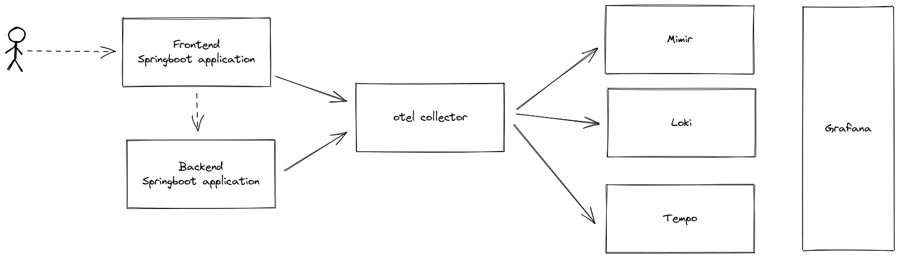

A demo of Springboot with Opentelemetry
------------------------

# Overview
This is a small demo application based on Springboot. 
The purpose with demo is to show the capabilities of using Springboot with Opentelemetry.
The application use:
- Springboot micrometer for metrics
- Springboot sleuth for tracing that include the opentelemetry sdk
- Spingboot logback for logging configuration
 


The demo is about an enterprise greetings application that have 2 microservices, a frontend and 
a backend. The frontend expose an api of the following url:
```shell
http://localhost:8080/greeting?name=XYZ
```
And just respond with:
```json
{"id":362,"content":"Bonjure, XYZ!"}
```
or
```json
{"id":362,"content":"Hello, XYZ!"}
```
The id is just the sequence of calls, and used as our greetings id. In the logs and traces are
the business logic around greetings injected as:
- greetingStatus
- greetingsId	
- greetingsLanguage
- greetingsName

The service is not very reliable, so you will find a high amount of problems in logs and traces.
And there is metrics that counts the number of greetings for both service, both totally and
the errors.

My goals are to show:
- Structured logs with json based layout output.
- Minimal logging, instead using tracing in combination with logs, and just have log entry in the "end" of a "session" - either okay or catch exception and log failure
- Metrics with focus on indicative problems - think your SLI
- Enable traceid as a common key between traces, logs and metrics
- Common labels that are injected on all different observability data
- What auto instrumentation give you for free and how to interact with local child spans
- Otel collector configuration - receivers. processors and exporters, especially what you can do with processors
- Visualize it all in grafana, so you can navigate between metrics, logs and traces 


# Todo
- Metrics with exemplars not implemented
- Native otel logging - currently to file and scraped by receiver `filelog`
- Add more micro services

# Design goals
Move as much metadata information as possible to the otel collector and try to separate between 
what is application specific and what is infrastructure and environment specific.

Using the opentelemetry agent in the jvm traces and metrics are pushed according to the agent
configuration.

## Traces
Traces are create by auto instrumentation. In the code we use opentelemetry annotations and
packages to create additional ones. 

## Metrics
Lots of metrics are created by the auto instrumentation and custom metrics is created with 
micrometer. 

## Logs
With logs the ambition is to show how to work with structured logs. This means:
- using thread local MDC to save key/value attributes.
- Static log messages, any dynamic content should be put in MDC's
- Log in the end of the execution by success or by exception and not log every code line.
- Output log data in a structured format  of json
- Format exceptions

With the auto instrumentation the log lines will be injected with trace and span id. This is 
key to be able to link logs to traces and the opposite.

> Some of this gluing is configuration in Grafana datasources but the information needs to be
> available 

The tools in play is slf4j and logback, and the important configuration is done in logback. 
Please see the logback.xml for details and explanation.

# Run 

The otel collector will send the observability data to the following:
- Metrics -> Mimir
- Logs -> Loki
- Traces -> Tempo

If you like to make it easy just set up a Grafana Cloud free account and start testing.

```shell
cp otel_conf_example.yml otel_conf.yml
# Update otel/conf.yml with the Grafana Cloud credentials
vi otel_conf.yml
```

Now it time to start the demo!

```shell
# Download the otel collector change version and os according to your needs
# https://github.com/open-telemetry/opentelemetry-collector-releases/releases

wget https://github.com/open-telemetry/opentelemetry-collector-releases/releases/download/v0.63.1/otelcol-contrib_0.63.1_linux_amd64.tar.gz

# Download the opentelemetry java agent
wget https://github.com/open-telemetry/opentelemetry-java-instrumentation/releases/download/v1.19.2/opentelemetry-javaagent.jar

# Build and package the backend
cd backend
export JAVA_HOME=$HOME/.jdks/openjdk-19.0.1/
export PATH=$JAVA_HOME/bin:$PATH

./mvnw clean package

# Endpoint to the otel collector
export OTEL_EXPORTER_OTLP_ENDPOINT=http://localhost:4317
export OTEL_METRIC_EXPORT_INTERVAL=15000

# Set the service name used on spans, for metrics this will be mapped to job
export OTEL_SERVICE_NAME=myBackendservice
# These resources attributes will be added to all trace spans and to a timeseries named target_info
# target_info can be used to promql join on the label job
export OTEL_RESOURCE_ATTRIBUTES=service.version=0.1.0, application=myBackendservice

java -javaagent:../otel/opentelemetry-javaagent.jar -jar ./target/rest-backend-complete-0.0.1-SNAPSHOT.jar

# In another window
# Build and package the frontend
cd frontend
export JAVA_HOME=$HOME/.jdks/openjdk-19.0.1/
export PATH=$JAVA_HOME/bin:$PATH
./mvnw clean package

# Endpoint to the otel collector
export OTEL_EXPORTER_OTLP_ENDPOINT=http://localhost:4317
export OTEL_METRIC_EXPORT_INTERVAL=15000

# Set the service name used on spans, for metrics this will be mapped to job
export OTEL_SERVICE_NAME=myWebservice
# These resources attributes will be added to all trace spans and to a timeseries named target_info
# target_info can be used to promql join on the label job
export OTEL_RESOURCE_ATTRIBUTES=service.version=0.1.0, application=myWebservice

java -javaagent:../otel/opentelemetry-javaagent.jar -jar ./target/rest-frontend-complete-0.0.1-SNAPSHOT.jar

# In another window
# local scrape
./otelcol-contrib --config=conf_local.yml
# remote 
~/programs//bin/otelcol-contrib --config=conf_micro.yml


# In another window
while [ true ] ; do curl -i http://localhost:8080/greeting?name=Foo; sleep 1; done

# In another window
while [ true ] ; do curl -i http://localhost:8080/greeting?name=Bar; sleep 2; done
```

Please the [OpenTelemetry SDK Autoconfigure](https://github.com/open-telemetry/opentelemetry-java/blob/main/sdk-extensions/autoconfigure/README.md) for
more configuration options.


# Setup Grafana

To enable correlation between logs and traces and vice verse you need to create additional information
to your data sources. 
> In grafana cloud you can not change the existing so just create new ones but pointing to the 
> endpoints you current datasources have. You must also create your own api keys.

For logs (Loki) create a datasource named `Loki-spring-to-traces` with the same endpoint and username
as the one that exists. 


It's in the section `Derived fields` the magic happen of mapping the trace id field in the log to
the Tempo data source. 
> Internal link should point to the tempo datasource.


In the directory `grafana/dashboards` there are two simple dashboards that can be imported to show some
application related dashboard and some jvm metrics.


# Links
otel contrib collector - https://github.com/open-telemetry/opentelemetry-collector-contrib/releases

